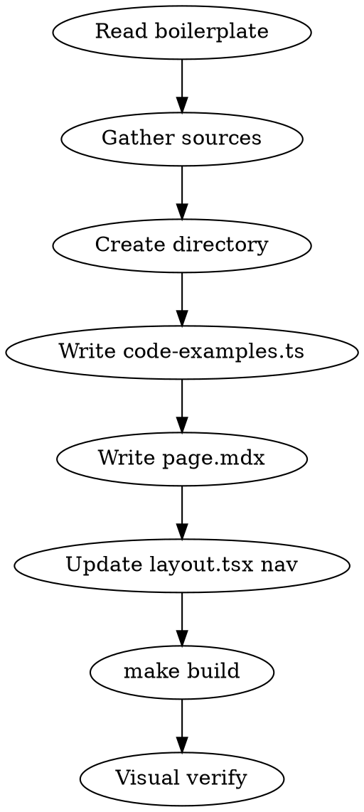

# Create Content Page

Add a new full-content documentation page to the AgentOps site following the established boilerplate pattern.

## Boilerplate Reference

Every content page follows the pattern established in `src/app/(docs)/tracing/connect-to-mlflow/`. Read that page and its `code-examples.ts` before creating new content.

## Workflow



### 1. Read the boilerplate

Read these files to understand the current pattern:

- `src/app/(docs)/tracing/connect-to-mlflow/page.mdx` (page structure)
- `src/app/(docs)/tracing/connect-to-mlflow/code-examples.ts` (code pattern)
- `src/app/(docs)/layout.tsx` (navigation structure)

### 2. Gather source material

Collect content from all sources the user provides: repos, web docs, existing code. Use Explore agents for repos and WebFetch for URLs. Extract:

- Conceptual explanations
- Working code examples (real, not contrived)
- Configuration snippets (YAML, env vars, Helm values)
- CLI commands

### 3. Create the directory

```
src/app/(docs)/<parent-topic>/<subtopic>/
```

### 4. Write code-examples.ts

```typescript
import { highlight } from '@/utils/highlight';

// QuickNav items — must match heading IDs generated by slugify()
export const quickNavItems = [
  { id: 'section-heading', text: 'Section Heading', level: 2 },
  { id: 'sub-heading', text: 'Sub heading', level: 3 },
];

// Raw code as template literals
const myCode = `import os
print("hello")`;

// Export highlighted HTML for CodeBlock
export const myCodeHighlighted = highlight(myCode);

// Export file arrays for Demo (multi-tab code viewer)
export const myFiles = [
  { name: 'main.py', content: highlight(myCode), language: 'python' },
  { name: 'requirements.txt', content: highlight(reqCode), language: 'text' },
];
```

**Heading ID rules:** The `slugify()` function in `mdx-components.tsx` lowercases, replaces non-alphanumeric runs with `-`, and trims leading/trailing hyphens. QuickNav `id` values must match exactly.

**highlight()** is a custom tokenizer in `src/utils/highlight.ts` — no external deps. It handles Python, JS, YAML, and shell syntax.

### 5. Write page.mdx

Follow this structure exactly:

```mdx
import { Demo } from '@/components/Demo'
import { CodeBlock } from '@/components/CodeBlock'
import { QuickNav } from '@/components/QuickNav'
import { FrameworkCards } from '@/components/FrameworkCards'
import { MarkdownLink } from '@/components/MarkdownLink'
import { quickNavItems, /* ... */ } from './code-examples'

<QuickNav items={quickNavItems} />

<div style={{ paddingTop: '1.5rem', paddingBottom: '5rem' }}>

# Page Title

<p className="MdSubtitle">
  One-line description of what this page covers.
  <MarkdownLink />
</p>

Two to three paragraphs of overview text explaining the concept,
why it matters, and how it works on OpenShift AI.

<FrameworkCards />

## First Section

### Subsection

Explanatory text.

<CodeBlock title="Descriptive title">{myCodeHighlighted}</CodeBlock>

## Agent Frameworks

### LangGraph

Description of how this framework uses the feature.

<Demo files={langgraphFiles} defaultCollapsed={true}>
  <div className="DemoPreviewText">
    <strong className="MdStrong">Key function or pattern</strong>
    <span> — What the example demonstrates</span>
  </div>
</Demo>

### CrewAI
...

</div>
```

**Page structure order:**
1. Imports
2. `<QuickNav items={quickNavItems} />`
3. Wrapper `<div>` with padding
4. `# Title` + `<p className="MdSubtitle">` with `<MarkdownLink />`
5. Overview paragraphs
6. `<FrameworkCards />` (if page covers per-framework examples)
7. Concept/setup sections with `<CodeBlock>`
8. Per-framework sections with `<Demo>` (collapsed by default)
9. Deployment/operational sections with `<CodeBlock>`
10. Closing `</div>`

### Available components

| Component | Use for | Props |
|-----------|---------|-------|
| `CodeBlock` | Single code snippet | `title` (string), children = highlighted HTML |
| `Demo` | Multi-file tabbed viewer | `files` (array), `defaultCollapsed` (boolean) |
| `FrameworkCards` | Agent framework card grid | none — links to `#langgraph`, `#crewai`, etc. |
| `QuickNav` | Right-sidebar TOC | `items` array of `{id, text, level}` |
| `MarkdownLink` | "View as Markdown" link | none — uses `usePathname()` |

### Tables in MDX

Use raw JSX with the `ApiTable` wrapper:

```mdx
<div className="ApiTable">
  <table>
    <thead><tr><th>Column</th><th>Description</th></tr></thead>
    <tbody>
      <tr><td><code className="MdCode">value</code></td><td>Explanation</td></tr>
    </tbody>
  </table>
</div>
```

Markdown tables also work (auto-wrapped by `mdx-components.tsx`), but JSX gives more control for inline code formatting.

### 6. Update navigation

In `src/app/(docs)/layout.tsx`, add the route to the `navigation` object:

```typescript
{
  title: 'Parent Topic',
  href: '/parent-topic',
  children: [
    { title: 'New Subtopic', href: '/parent-topic/new-subtopic' },
  ],
},
```

### 7. Build and verify

```bash
make build          # Must compile with zero errors
npx serve out -l 3000 &
# Open in playwright-cli or browser to visually verify:
# - 3-column layout (sidebar, content, QuickNav)
# - FrameworkCards render correctly
# - CodeBlock/Demo components display code with syntax highlighting
# - All QuickNav links scroll to correct headings
# - Tables render with ApiTable styling
```

## Common Mistakes

- **QuickNav id mismatch** — `id` must match what `slugify()` produces from the heading text. Test: lowercase the heading, replace non-alphanumeric with `-`, trim edges.
- **Missing wrapper div** — The `<div style={{ paddingTop: '1.5rem', paddingBottom: '5rem' }}>` wrapper is required. Without it, spacing breaks.
- **FrameworkCards without matching headings** — The cards link to `#langgraph`, `#crewai`, `#autogen`, `#llamaindex`, `#google-adk`. Headings must produce these exact IDs.
- **Forgetting to close `</div>`** — The wrapper div must close at the end of the MDX file.
- **Using `.tsx` instead of `.mdx`** — Full content pages use `.mdx` (MDX rendering). Stub pages may use `.tsx` but content pages must be `.mdx` to get markdown styling.
